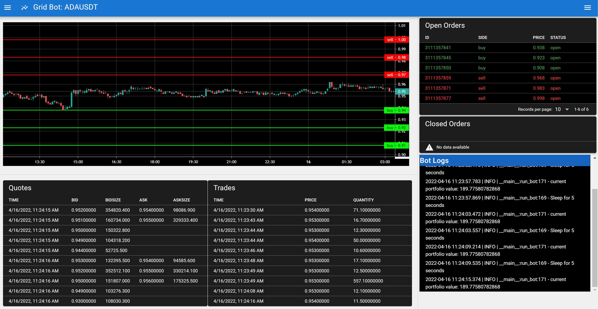

# Grid Bot using Python & Javascript

## Introduction
A grid bot using Python & Javascript. 
- Vue.js / Quasar framework used for the frontend ui.
- Market data uses the Binance REST and websocket API.
- References:
  - [Part Time Larry YouTube Playlist on Grid Bot](https://www.youtube.com/playlist?list=PLvzuUVysUFOtb2wF0gQ10_YD3ushEDtrd)

1) Start web socket server:
   - python -m server.ws_server:
2) Start grid bot:
   - python -m bot.grid_bot
3) Start web client:
   - yarn run dev
   

